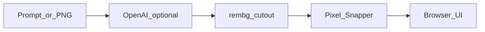

# MCPixel

Local pixel art suite: **generate → remove background → snap to grid → tweak**.

[](LICENSE)
[](https://www.python.org/)
[](https://docs.docker.com/compose/)
[](https://fastapi.tiangolo.com/)
[](https://platform.openai.com/)
[](https://github.com/danielgatis/rembg)

Turn a text prompt (or your own PNG) into clean, grid-aligned pixel art in the browser. Everything runs on your machine via Docker. You bring your own API keys (BYOK) when you want AI generation.

> Not an official [Sprite Fusion](https://www.spritefusion.com/) product. MCPixel uses [Pixel Snapper](https://github.com/Hugo-Dz/spritefusion-pixel-snapper) as a binary dependency (MIT — see [`THIRD_PARTY_NOTICES`](THIRD_PARTY_NOTICES)).

---

## Why MCPixel?

Making game-ready pixel sprites usually means bouncing between an image generator, a background remover, and a snapping tool. MCPixel pipes those steps together in one local app:

- Describe a sprite (or upload an image you already have)
- Cut out the background
- Snap colors and edges to a pixel grid
- Tweak and re-snap without paying for a new generation

Your assets and keys stay on your computer. No account with MCPixel itself — just Docker and, optionally, an OpenAI key.

## Features

- **Prompt or upload** — generate with OpenAI Images, or skip generation and upload a PNG
- **Background removal** — rembg (u2net by default; BiRefNet optional) with optional alpha hardening
- **Pixel snap** — [Pixel Snapper](https://github.com/Hugo-Dz/spritefusion-pixel-snapper) baked into the Docker image
- **Resnap** — reuse a cutout and re-run snap without a new generation cost
- **Skip cutout** — if the image is already transparent, jump straight to snap
- **Runs locally** — one `docker compose` command; open the UI in your browser

## How it works

```text
prompt (or upload) → OpenAI Images (optional) → rembg cutout → pixel snapper → tweak / resnap
```



## Requirements

- [Docker Desktop](https://www.docker.com/products/docker-desktop/) (Mac/Windows) or Docker Engine with Compose (Linux)
- An [OpenAI API key](https://platform.openai.com/api-keys) **only if** you want text-to-image generation  
  Without a key you can still upload a PNG and run cutout + snap.

## Install

### 1. Install Docker

Download and install [Docker Desktop](https://www.docker.com/products/docker-desktop/) (or your platform’s Docker Engine + Compose). Start Docker and wait until it shows as running.

### 2. Get the project

```bash
git clone https://github.com/bicrick/MCPixel.git
cd MCPixel
```

Or download the ZIP from GitHub and open a terminal in that folder.

### 3. Create your settings file

```bash
cp .env.example .env
```

Open `.env` in any text editor. To enable AI generation, set:

```bash
OPENAI_API_KEY=sk-your-key-here
```

Leave it blank if you only plan to upload images.

### 4. Start MCPixel

```bash
docker compose up --build
```

The first run builds the image (including Pixel Snapper) and may download the rembg model — that can take a few minutes. Later starts are much faster.

### 5. Open the app

In your browser go to:

**http://127.0.0.1:8787**

To stop the app, press `Ctrl+C` in the terminal (or stop the stack from Docker Desktop).

## Configuration

Most people only need the OpenAI key. These are the knobs that matter day to day (edit `.env`, then restart Compose):

| Variable | What it does |
| --- | --- |
| `OPENAI_API_KEY` | Enables text-to-image generation. Empty = upload-only mode. |
| `OPENAI_IMAGE_MODEL` | Image model name (default: `gpt-image-1`). |
| `REMBG_MODEL` | Background model: `u2net` (default), `isnet-general-use`, or `birefnet-general` (needs ~12GB+ RAM). |
| `ALPHA_HARDEN_THRESHOLD` | Makes cutout edges more hard-edged (default: `128`). |

The UI listens on port **8787** (see `docker-compose.yml` if you need to change the published port). Other variables in `.env.example` are for advanced setups; Docker Compose already sets the Snapper binary and data directory for you.

## License

MIT for MCPixel — see [`LICENSE`](LICENSE).

Pixel Snapper remains copyright Hugo Duprez (MIT). Full notice: [`THIRD_PARTY_NOTICES`](THIRD_PARTY_NOTICES).

Bring your own keys: OpenAI (and any other third-party APIs you enable) bill you under their terms. MCPixel does not sell API access.
